# Theo dõi và báo cáo hoạt động của ví

Để  theo dõi và có dữ để làm báo cáo về hoạt động của ví => sử dụng hai hệ thống:

* **Hệ thống Grafana**: Grafana là một hệ thống mã nguồn mở dùng để tạo và quản lý các bảng điều khiển dữ liệu và đồ thị phân tích.
  
    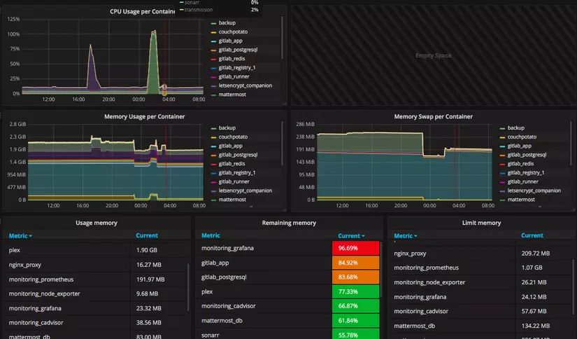

* **Hệ thống Graylog**: Graylog là một hệ thống quản lý nhật ký (log management system) mã nguồn mở, được sử dụng để thu thập, xử lý và phân tích các bản ghi nhật ký từ các nguồn khác nhau.
    
    
     

## Hệ thống Grafana:
- URL: http://10.22.111.40
- Đăng nhập: Tài khoản  + Passwork (được cấp)
- Theo dõi:
  - Redis: 
  - Nginx
  - GETH
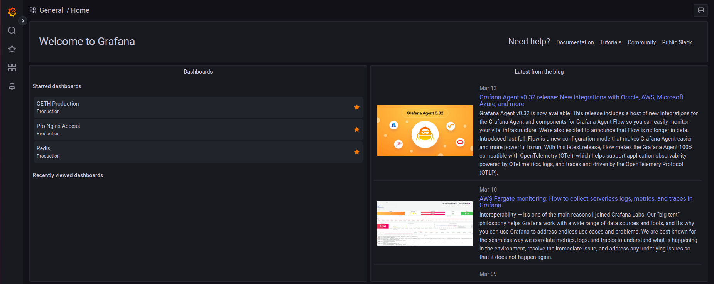

- Chi tiết:
  - Redis: 
    - Theo dõi số  lượng key trong hệ thống, các kết nối giữa các slave và master
  
        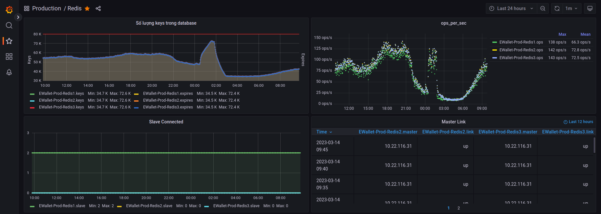
        
        ***Note:*** Khi hệ thống có quá nhiều key thì hệ thống sẽ lỗi 

    - Theo dõi Network, CPU, Memory và số lượng client kết nối

        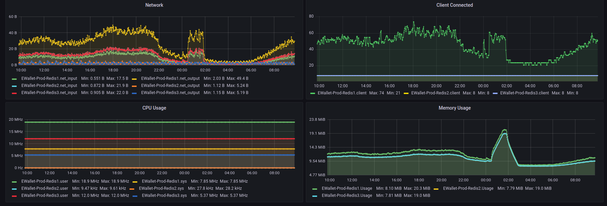

  - GETH:
    - Theo dõi số lượng các block của các Geth

         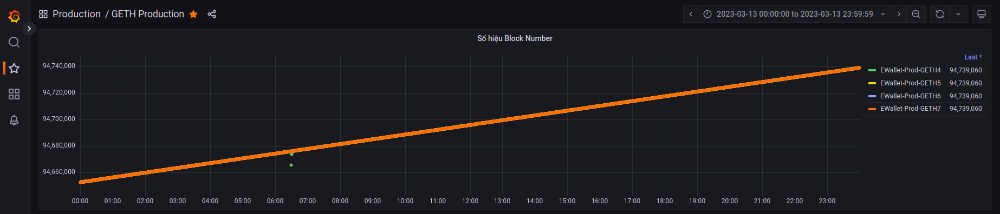

        ***Note:*** Khi hệ thống hoạt động bình thường thì đồ  thị số lượng Geth sẽ là tuyến tính
    - Theo dõi TXPool status:  Là trạng thái của TXP Pool, thường được sử dụng để mô tả trạng thái của các giao dịch đang chờ xử lý trong TXP Pool.

         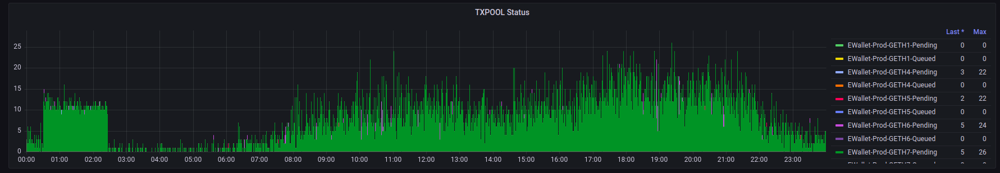

        ***Note:*** Có hai trạng thái là **Pending** và **Queued**. Khi geth rơi vào trạng thái **Queued** thì cần check hệ thống

    - Theo dõi Blocks được đồng thuận ghi vào chain
        
        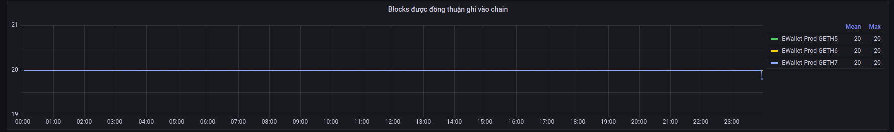

        ***Note:*** Khi hệ thống hoạt động bình thường thì số block được đồng thuận ghi và chain của các geth là như nhau

  - NGINX: 
    - Theo dõi số lượng resquest và response

        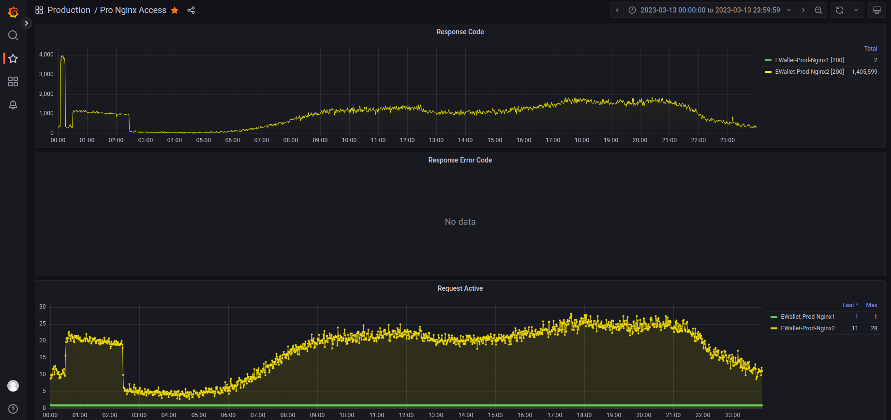

    - Theo dõi TPS của Nginx: TPS (Transactions Per Second) là một đơn vị đo lường hiệu suất thường được sử dụng để đo lường số lượng resquest được thực hiện trong một giây
        
        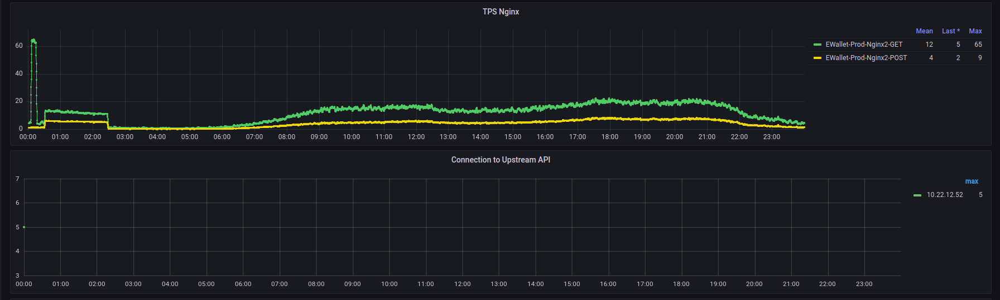
- ***Note***: Hệ thống Grafana chỉ thống kê dữ liệu trong vòng 48h

## Hệ thống Graylog

- URL: http://10.22.111.10
- Đăng nhập: Tài khoản  + Passwork (được cấp)
- Theo dõi: Theo dõi toàn bộ log trong code của hệ thống (Error, Info, Fatal, Init, ...)

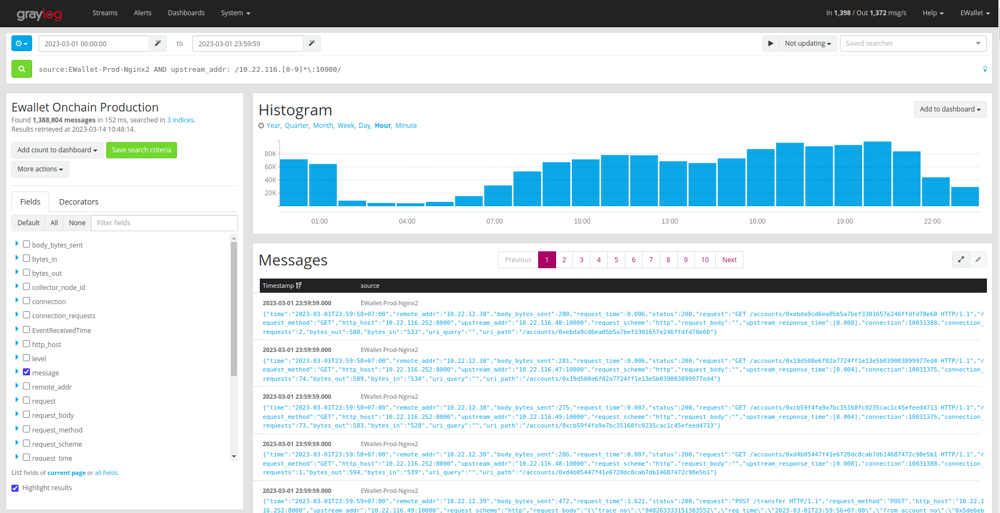

- Một số  câu lệnh tìm kiếm cơ bản:

    |  STT  |                                               Câu lệnh                                                |                  Ý nghĩa                  |
    | :---: | :---------------------------------------------------------------------------------------------------: | :---------------------------------------: |
    |   1   |                source:EWallet-Prod-Nginx2 AND upstream_addr: /10.22.116.[0-9]*\:10000/                |           Lấy số lượng resquest           |
    |   2   | source:EWallet-Prod-Nginx2 AND upstream_addr: /10.22.116.[0-9]*\:10000/ AND upstream_response_time:>3 | Lấy số lượng resquest có thời gian hơn 3s |
    |   3   | source:EWallet-Prod-Nginx2 AND upstream_addr: /10.22.116.[0-9]*\:10000/ AND upstream_response_time:>2 | Lấy số lượng resquest có thời gian hơn 2s |
    |   4   |      source:EWallet-Prod-Nginx2 AND upstream_addr: /10.22.116.[0-9]*\:10000/ AND message:"POST"       |        Lấy số lượng POST resquest         |
    |   5   |       source:EWallet-Prod-Nginx2 AND upstream_addr: /10.22.116.[0-9]*\:10000/ AND message:"GET"       |         lấy số lương GET resquest         |

# Báo cáo

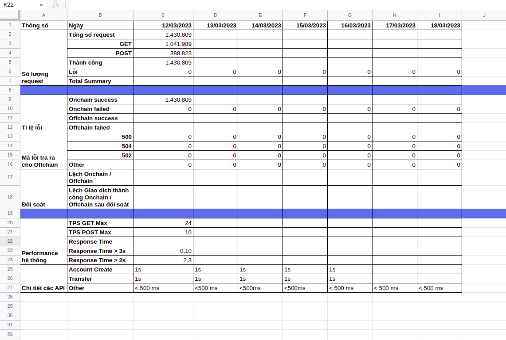

Dữ liệu trong báo cáo được lấy hàng ngày và theo tuần

Chi tiết:

- Lấy số  lượng request: Lấy trong số  lượng request Ngnix  của Grafana hoặc chạy câu lệnh [1] của Graylog

    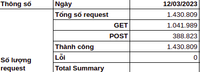

- Lấy tỷ lệ lỗi: Lấy trong số  lượng request Ngnix của Grafana

    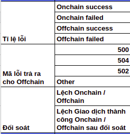

- Lấy hiệu suất: 

    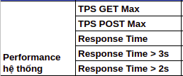

    * TPS GET MAX, TPS POST MAX: Lấy trong TPS Ngnix của Grafana
    * Response Time > 3s, Response Time > 2s: (Chạy câu lệnh [2], [3] trong Graylog) / (Tổng số  resquest POST)

- Chi tiết API: Lấy trong Upstream Response KEYMAN Nginx của Grafana
    
    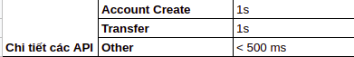

