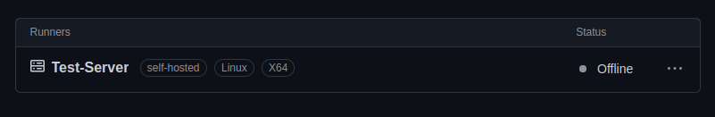
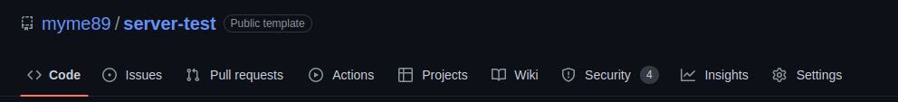
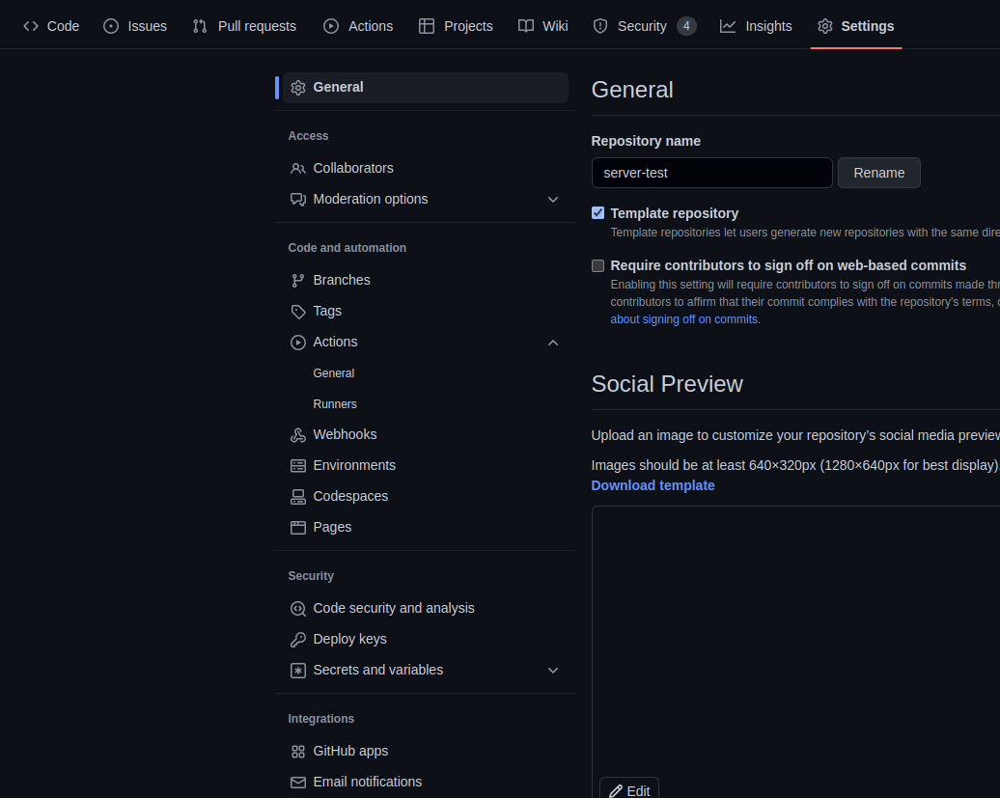
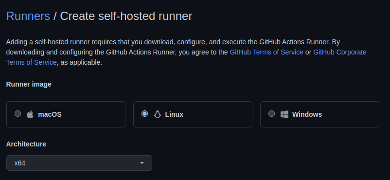
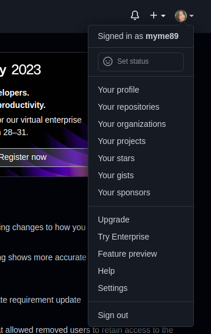
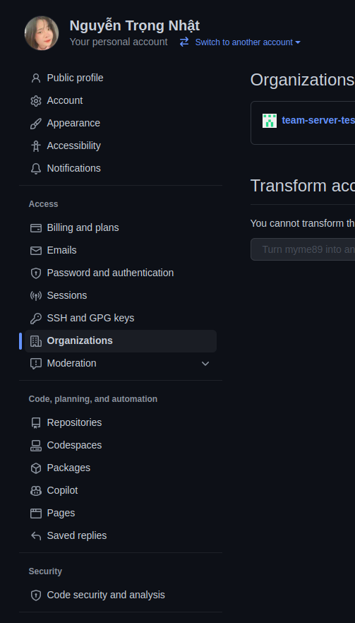
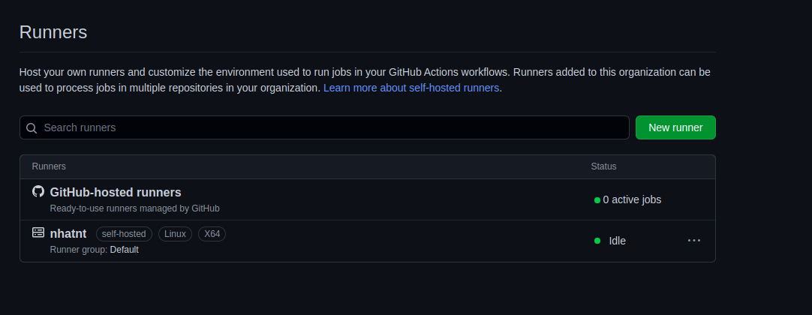

# Github Self-hosted Runners

## Giới thiệu Self-hosted runners

Self-hosted runner là một hệ thống mà bạn tự triển khai và quản lý để thực hiện các công việc từ Github Actions trên GitHub.

Bạn có thể  thêm Self-hosted runners cho:
* Repository:  Triển khai  dể xử lý công việc dành riêng cho một repository duy nhất.
* Organization: Triển khai để xử lý công việc cho nhiều repository trong một organization.
* Enterprise: Triển khai để chỉ định các organization trong một tài khoản  enterprise

***Note:*** Một self-hosted runner sẽ được tự động xóa khỏi Github nếu nó không được kết nối với Github Action quá 14 ngày.

## Các thuộc tính của Self-hosted runners

* Name: Tên của runner, được sử dụng để định danh runner trên GitHub.

* Labels: Nhãn được gán cho runner, được sử dụng để phân loại các runner trong repository.
  

* Version: Phiên bản của runner - thông tin hiện lên khi run Self-hosted runners trên termial
  
        Current runner version: '2.303.0'
  
* Status: Trạng thái hiện tại của runner, bao gồm cả trạng thái kết nối đến GitHub và trạng thái hoạt động của runner.
  * Idle: Runner được kết nối với GitHub và sẵn sàng thực hiện các công việc.
  * Active: Runner hiện đang thực hiện một công việc.
  * Offline: Runner không được kết nối với GitHub. Điều này có thể do đang ngoại tuyến, ruuner không chạy hoặc runner không thể giao tiếp với GitHub.
  
* Concurrent jobs: Số lượng job tối đa có thể được chạy trên runner cùng một lúc.
  ***Note:*** Concurrent jobs phụ thuộc vào khả năng xử lý của máy chủ hoặc thiết bị chạy runner đó.

    

    Ví dụ: Trên là 1 Self-hosted runners đã được tạo với các thông tin: 
    *  Name:  Test-Server
    *  Labels: self-hosted, Linux, X64
    *  Status: Offline

## Các bước để  triển khai một Github Self-hosted Runner cho một Repository

1. Vào GitHub.com, chọn repository muốn triển khai
2. Dưới tên của repository, chọn **Settings**
      
3. Ở phía bên trái, chọn  **Actions** và chọn chọn tiếp **Runners**.
      
     
4. Chọn **New self-hosted runner**.
      

5. Chọn hệ điều hành và kiến trúc cho self-hosted runner.
      

6. Sau đó sẽ thấy hướng dẫn download và cài đặt self-hosted runner. Mở terminal và làm theo hướng dẫn.
     
    Ví dụ: Cài đặt Github Self-hosted Runner với hệ điều hành Linux and kiến trúc x64

        1. Download
            # Create a folder
                $ mkdir actions-runner && cd actions-runner
          
            # Download the latest runner package
            $ curl -o actions-runner-linux-x64-2.302.1.tar.gz -L https://github.com/actions/runner/releases/download/v2.302.1/actions-runner-linux-x64-2.302.1.tar.gz
          
            # Optional: Validate the hash
                $ echo "3d357d4da3449a3b2c644dee1cc245436c09b6e5ece3e26a05bb302501xxxx  actions-runner-linux-x64-2.302.1.tar.gz" | shasum -a 256 -c# Extract the installer
                $ tar xzf ./actions-runner-linux-x64-2.302.1.tar.gz

        2. Configure
            # Create the runner and start the configuration experience
                $ ./config.sh --url https://github.com/myme89/server-test --token ASDTKMQHWJOA4VZQPLBCJUDExxxxx
              
            # Last step, run it!
                $ ./run.sh

            //Using your self-hosted runner
            # Use this YAML in your workflow file for each job
               runs-on: self-hosted

7. Kiểm tra cài đặt self-hosted runner: Khi runner được kết nối với GitHub thành công và sẵn sàng thực hiện công việc thì sẽ thấy thông báo sau trên terminal vừa chạy ở bước 6.
     
          √ Connected to GitHub

          2022-03-04 09:45:56Z: Listening for Jobs

***Note:*** 
* *Nếu repository tạo cá nhân thì chỉ có chủ sở hữu của repository mới có quyền triển khai self-hosted runner trên repository đó - Chỉ có chủ sở hữu của repository mới thực hiện được các bước nêu trên để tạo ra một self-hosted runner*
* *Nếu repository tạo trong organizations thì cần:*
  * *Được chủ sở hữu của organizations cấp quyền **maintain** hoặc **admin***
  * *Thành viên của organizations đươc organizations cấp quyền **admin** cấp quyền **maintain** hoặc **admin***

## Các bước để  triển khai một Github Self-hosted Runner cho một Organization

1. Vào GitHub.com, vào **Organizations** và chọn Organizations muốn triển khai
   
2. Dưới tên của organizations, chọn **Settings**
      
3. Làm các bước tiếp theo tương tự như các bước 3, 4, 5, 6, 7 của ***Triển khai một Github Self-hosted Runner cho một Repository***
   
    ***Note:*** *Chỉ có chủ sở hữu của Organization hoặc các thành viên được cấp quyền chủ sở hữu mới có quyền triển khai self-hosted runner trên Organization đó - Chỉ có chủ sở hữu của Organization mới thực hiện được các bước nêu trên để tạo ra một self-hosted runner*

## Các bước tạo một Organization trong tài khoản Github
1. Chọn vào **Avatar** góc bên phải, sau đó chọn **Your organizations**.
   
      

    ***Note:*** Nếu làm như trên mà không có thì chọn vào **Avatar** góc bên phải, sau đó chọn **Settings**. Phái bên trái chọn **Organizations**

      

2. Chọn **New organization**
      
3. Chọn loại organization muốn tạo.
    
   ***Note***: Chọn loại organization phù hợp với nhu cầu sử dụng thông tin tại https://github.com/organizations/plan
   
   Trong ví dụ ở đây, chọn **Create a free organization**
4. Tạo thành công sẽ được như được như dưới đây:
    
   

## Các bước để  triển khai một Github Self-hosted Runner cho nhiều Repository

Để  triển khai thành công một Github Self-hosted Runner cho nhiều Repository:
1. Trong tài khoản github tạo một Organization các bước thực hiện như ở trên **Các bước tạo một Organization trong tài khoản Github**

2. Tạo các Repository trong Organization vừa tạo

3. Tạo Github Self-hosted Runner cho Organization theo ***Các bước để  triển khai một Github Self-hosted Runner cho một Organization***

4. Khi triển khai thành công sẽ được như dưới đây:
    

## Các bước để  triển khai nhiều Github Self-hosted Runner cho một Repository

Để  triển khai thành công nhiều Github Self-hosted Runner cho một Repository:
1. Chọn Repository muốn tạo

2. Tạo các runners theo **Các bước để  triển khai một Github Self-hosted Runner cho một Repository** đến bước cấu hình run trên terminal -> Cấu hình tên **Lable** cho từng runner ngoài 3 **Label** mặc định
   
   ***Note:*** Ở mặc định, các Self-hosted Runner có 3 Label mặc định giống nhau được sử dụng trong **run-on** ở file .YML là:
   * Self-hosted: Công việc thực hiện Github Self-hosted Runner
   * Architecture, Operator System: Kiến trúc của Self-hosted Runner phụ thuộc lựa chọn kiến trúc và hệ điều hành mà người tạo chọn. Ví dụ khi người tạo chọn hệ điều hành Linux và kiến trúc X64 thì sẽ có 2 Label là X64 và Linux

3. Sử dụng trong file .YML: Khi đã thêm **Label** cho từng runners ở bước 2 thì khi sử dụng trong file .YML mỗi runner sẽ chạy cho mỗi công việc khác nhau. Ví dụ: Tạo 2 runner trong 1 Repository với hệ điều hành Linux, kiến trúc x64 và đặt tên Label cho từng runner lần lượt là test và test2. Sau khi tạo ta sẽ dùng như sau trong file .YML:
    
        jobs:

            build: //name jobs 1
                runs-on: [self-hosted, linux, x64, test]
                steps:
                - name: Echo message
                run: echo "Hello, World Trong  Nhat!"

            test: //name jobs 2
                runs-on: [self-hosted, linux, x64 test2]
                steps:
                - name: Echo message
                run: echo "Hello, World Trong  Nhat!"

# .YML Template File For Github Action

Here's a basic YAML template file for a GitHub Action:

        name: Template GitHub Action
        on:
            push:
                branches: [master]

            pull_request:

                branches: [master]
       
        jobs:
            build:
                runs-on: ubuntu-latest
                steps:
                - name: Checkout repository
                    uses: actions/checkout@v3

                - name: Setup Go 
                    uses: actions/setup-go@v3
                    with:
                        go-version: ^1.20

                - name: Run tests
                    run: npm test

                - name: Release
                    uses:  actions/create-release@v1

                    env:
                        GITHUB_TOKEN: ${{ secrets.GITHUB_TOKEN }}
                    with:
                        tag_name:  ${{ github.ref }}
                        release_name: Release ${{ github.ref }}
                        draft: false
                        prerelease: false  

An explanation of the various parameters:

* **name**: *The name of your GitHub Action.*
  
        name: Template GitHub Action

* **on**: *Specifies the events that will trigger your action. In this case, the action will run on any push or pull request to the **master** branch.*

        on:
            push:
                branches: [master]

            pull_request:

                branches: [master]
    *Additional resources:*
    * Event activity type: https://docs.github.com/en/actions/using-workflows/triggering-a-workflow
    * Details each event type activity type: https://docs.github.com/en/actions/using-workflows/events-that-trigger-workflows

* **jobs**: *Defines one or more jobs that make up the action.*
  
    *Additional resources:* https://docs.github.com/en/actions/using-jobs
    
* **build**: *The name of the job.*

* **runs-on**: *The type of machine that the job will run on.*
  
Can use the latest version of Ubuntu (GitHub-hosted runners)

        runs-on: ubuntu-latest

Or Github Self-hosted Runner

        runs-on: [self-hosted, linux]

*Additional resources:* https://docs.github.com/en/actions/using-jobs/choosing-the-runner-for-a-job

* **steps**: *The list of steps to execute in the job.*

* **uses**: *A pre-built action to use.* 
  
In this case, it's the actions/checkout@v3 action which checks out your repository on the runner.*

        uses: actions/checkout@v3

Or it's the actions/setup-go@v3 action which set up Golang on the runner.
    
        uses: actions/setup-go@v3

* **name**: *The name of the step. This is purely for informational purposes.*
  
* **run**: *The command to run in the step. In this case, it's a series of steps that run tests.*
  
* **with**: *Provides inputs to the action.* 
  
In this case, it provides the environment, target, and secret key required for the release. Note that the tag_nam value is loaded from a GitHub with github.ref or GITHUB_TOKEN value is loaded from a Github secret named GITHUB_TOKEN

        GITHUB_TOKEN: ${{ secrets.GITHUB_TOKEN }}

        tag_name:  ${{ github.ref }}

